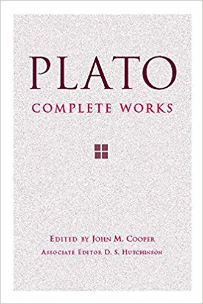

I used to teach philosophy. I miss it. So, I'm going to try something new-for-me, now. What I'm going to do is, I'm going to read through various pieces of philosophy and write blog posts, sort of in the form of lecture notes, about the things that I read. I'm aiming for a chapter-length piece per week, at a minimum. 

Now. What should I read first? 

...

In an effort to avoid decision paralysis, and avoid ending up like [Buridan's ass](https://en.wikipedia.org/wiki/Buridan%27s_ass), I'm just going to grab a random book from my bookshelf and go with it.

...

And we have a winner!

I've had this book for about ten years and I've not gotten as much use out of it as I'd like. I've used it to write a handful of papers for graduate school classes, and I was fairly sure it was referencecd in my [dissertation](http://purl.flvc.org/fsu/fd/FSU_migr_etd-9314) but it turns out it wasn't. 

Well, then. This is where I'll start. I hope you enjoy this. Heck, I hope **EYE** enjoy it. If you have any questions, please don't hesitate to reach out.
