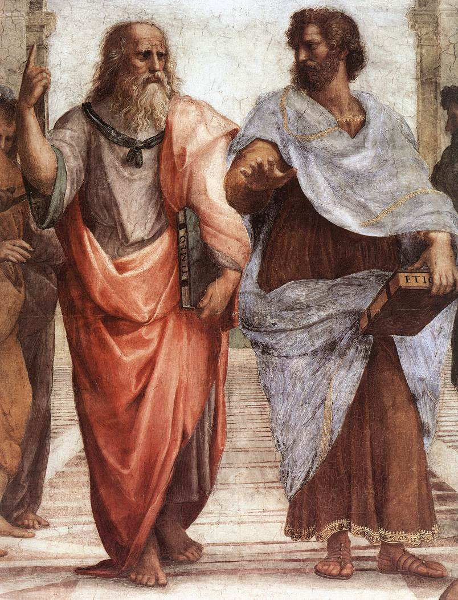

Before we get into the nitty-gritty philosophical stuff, I figured it might be a good idea to take a minute to talk about Plato himself -- Plato the Philosopher -- for a bit first.

> **Quick Hits**
>  * Born: 427 BCE, Athens, Greece
>  * Died: 347 BCE, near Athens, Greece
>  * Was Taught By: Socrates
>  * Was Teacher of: Aristotle
>  * Most famous idea: There are genuinely **lots** of famous ideas.

Ancient historian [Diogenes Laertius](https://en.wikipedia.org/wiki/Diogenes_La%C3%ABrtius) wrote one of the best known biographies of Plato. An english translation is [freely available](http://data.perseus.org/texts/urn:cts:greekLit:tlg0004.tlg001.perseus-eng1) via [Tufts University's Perseus Digital Library](www.perseus.tufts.edu/).

Diogenes Laertius, citing [Apollodorus](https://en.wikipedia.org/wiki/Apollodorus_of_Athens), says that Plato was born in the year of the 88th Olympiad; and citing [Hermippus](https://en.wikipedia.org/wiki/Hermippus), says that Plato died the same year as the 108th Olympiad. There are a handful of alternative accounts of when and where he died, though. Given other historical accounts of these events, as well as other events described by folks about Plato's life, it's generally agreed that he was born in 427 BCE and died in 347 BCE. Old boy lived to be around 80 years old. 

In his early years, Plato was, among other things, an artist -- a poet. He continued to write poetry, including many love poems, throughout his life. 

But things really kick off, as far as I'm concerned, when at around the age of 20, Plato starts studying with ol' Socrates. (Not [that one](https://en.wikipedia.org/wiki/S%C3%B3crates).)

Socrates was kind of famous for being a bit of a turd. He was the sort of person who would insist people think about things way more than they, eventually, wanted to. Oh, it would often start off as a nice intellectual exercise. "But what do you mean __justice__?", he'd ask. And next thing you know, it's Friday. 

Socrates is sort of a huge deal for Plato. Plato's writings are largely -- all of the ones I'm familiar with are -- written in dialog form. They're often exchanges between a person voicing what we take as either Socrates' or Plato's philosophy -- usually it's Socrates' voice, and examining and explaining the ideas presented in conversation with other people. Many of the dialogs are taken to be actual accounts of conversations that took place between the people involved in them. Though, of course, how accurately these dialogs are represented is a matter of debate.

After Socrates was tried, convicted, and put to death for "corrupting the youth", an account of which I'll get to talking about when I read through [_Apology_](http://www.perseus.tufts.edu/hopper/text?doc=Perseus%3Atext%3A1999.01.0170%3Atext%3DApol.), Plato traveled a bit before settling back down in or near Athens. He founded a school called The Academy and began teaching, among other things, philosophy and mathematics (in addition to being influenced by Socrates, Plato was also heavily influenced by the [Pythagoreans](https://en.wikipedia.org/wiki/Pythagoreanism)). There he took on bunches of students, the most famous of whom was [Aristotle](https://en.wikipedia.org/wiki/Aristotle). Their relationship is famously depicted by Renaissance artist and/or sewer-dwelling, crime-fighting turtle [Raphael](https://en.wikipedia.org/wiki/Raphael) in the fresco [The School of Athens](https://en.wikipedia.org/wiki/The_School_of_Athens). 

<figure>
  
  <figcaption>
  <small><a href="https://en.wikipedia.org/wiki/en:Raphael" class="extiw" title="w:en:Raphael">Raphael</a> - <a href="https://en.wikipedia.org/wiki/Web_Gallery_of_Art" class="extiw" title="en:Web Gallery of Art">Web Gallery of Art</a>: &nbsp; <a rel="nofollow" class="external text" href="http://www.wga.hu/art/r/raphael/4stanze/1segnatu/1/athens1.jpg">Image</a>&nbsp; <a rel="nofollow" class="external text" href="http://www.wga.hu/html/r/raphael/4stanze/1segnatu/1/athens1.html">Info about artwork</a>, Public Domain, <a href="https://commons.wikimedia.org/w/index.php?curid=75881">Link</a></small>
  </figcaption>
</figure>

Notice Plato on the left, Aristole on the right. Plato's pointing up, Aristotle's pointing toward the horizon. Plato's holding his work _Timaeus_, Aristotle's holding his work _Nicomachean Ethics_. All of these things are references to philosophical differences between the two. Plato's pointing to the sky is a reference to his concern with the abstract, fundamental nature of the world, whereas Aristotle's gesturing toward the horizon is a reference to his concern with the things _in_ the world -- more practical matters. Plato wrote about many different philosophical matters, including the difference between generalized concepts and particular instantiations of those contepts (like, the difference between the concept of a chair and a particular chair), justice and the ideal State, he had views on whether or not people are born with innate concepts, the nature of memory, the difference between philosophy and rhetoric, and many others. Aristotle, on the other hand, wrote about biology, physics, ethics, animals, metaphysics, and many, many other things. 

Both Plato and Aristotle are incredibly influential in the history of European philosophical thought. Twentieth century philosopher and mathematician Alfred North Whitehead famously wrote about Plato,
> "The safest general characterisation of the European philosophical tradition is that it consists of a series of footnotes to Plato."
> -- [Process and Reality](https://en.wikipedia.org/wiki/Process_and_Reality), 1929

I plan on writing a series of posts on Aristotle's work in the future. But for now, let's get started on Plato. 

Here's how I figure things will roll out. I count 45 chapters in [_Plato Complete Works_](https://books.google.com/books/about/Complete_Works.html?id=Fv9AKY_DBVYC), and it's not clear whether or not Plato really wrote 17 of them. So I figure I'll just go through, one by one (until I get bored with Plato?), reading and writing about the ones that are deffo Plato's work.

First up, then, is [Euthyphro](http://www.perseus.tufts.edu/hopper/text?doc=Perseus:text:1999.01.0170). I'll follow that up with [Apology](http://www.perseus.tufts.edu/hopper/text?doc=Perseus%3Atext%3A1999.01.0170%3Atext%3DApol.). Then [Crito](http://www.perseus.tufts.edu/hopper/text?doc=Perseus%3Atext%3A1999.01.0170%3Atext%3DCrito), then [Phaedo](http://www.perseus.tufts.edu/hopper/text?doc=Perseus%3Atext%3A1999.01.0170%3Atext%3DPhaedo). 

Look for the first post on Euthyphro in the next couple or few days.
